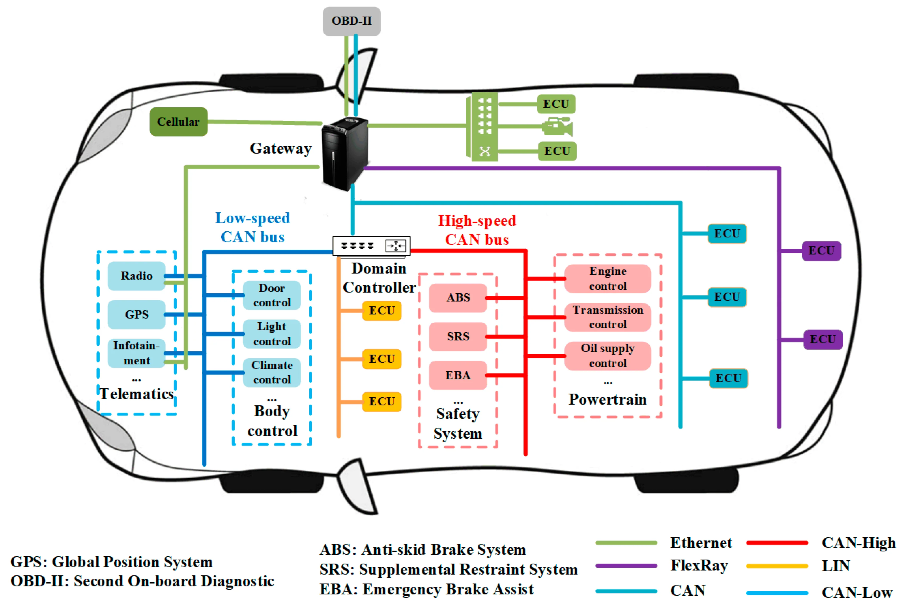

# NetAutoX

## 1. Overview

> Figure 1: Overwive of Automobile NetWork [(Source)](https://softwareg.com.au/blogs/internet-security/automobile-can-bus-network-security-and-vulnerabilities).

## 2. Comparison of CAN, LIN, FlexRay, and Automotive Ethernet

### 2.1. Basic Parameters Comparison

| Feature             | **CAN**                               | **LIN**                                | **FlexRay**                            | **Automotive Ethernet**               |
|---------------------|---------------------------------------|----------------------------------------|----------------------------------------|---------------------------------------|
| **Speed**           | Standard CAN: 1 Mbps CAN FD: 8 Mbps | Up to 20 kbps                          | 10 Mbps per channel 20 Mbps (dual-channel) | 100 Mbps to 10 Gbps                 |
| **Topology**        | Bus topology                          | Master-slave                           | Bus, star, hybrid                      | Point-to-point (requires switch)     |
| **Frame Length**    | Standard: 8 bytes CAN FD: 64 bytes | Up to 8 bytes                          | Up to 254 bytes                        | Up to 1500 bytes (MTU)               |
| **Priority**        | Determined by identifier arbitration  | Controlled by master node scheduling   | Fixed time-slot scheduling             | No inherent priority; depends on QoS |
| **Communication**   | Multi-master, multi-point             | Single-master, multi-slave             | Point-to-point, broadcast              | Point-to-point                       |
| **Synchronization** | Event-triggered                      | Schedule-driven                        | Time-triggered (strict time sync)      | Upper-layer protocol sync (e.g., PTP) |
| **Bandwidth Utilization** | Medium (50%-70%)               | Low (due to sync overhead)             | High (optimized by time slots)         | High (optimized by switches)         |
| **Latency**         | Low to medium (optimized by arbitration) | High (depends on master scheduling)  | Low (deterministic scheduling)         | Low (optimized by high-speed switches) |

---

### 2.2. Data Transmission Capability

| Feature             | **CAN**                               | **LIN**                                | **FlexRay**                            | **Automotive Ethernet**               |
|---------------------|---------------------------------------|----------------------------------------|----------------------------------------|---------------------------------------|
| **Real-time Capability** | High                           | Low                                    | Very high                              | High                                 |
| **Data Throughput** | Medium (suitable for moderate loads)  | Low                                    | High                                   | Very high (supports multimedia, big data) |
| **Transmission Model** | Event-driven (asynchronous)       | Polling-driven                         | Mixed time-triggered and event-triggered | Standard TCP/IP model               |
| **Reliability**     | High (robust error detection)         | Moderate                               | High (dual-channel redundancy)         | High (via CRC, retransmissions)      |
| **Data Integrity**  | High (CRC-based)                     | Low                                    | High (extended CRC checks)             | High (hardware-accelerated CRC)      |

---

### 2.3. Hardware Complexity and Cost

| Feature             | **CAN**                               | **LIN**                                | **FlexRay**                            | **Automotive Ethernet**               |
|---------------------|---------------------------------------|----------------------------------------|----------------------------------------|---------------------------------------|
| **Hardware Complexity** | Moderate                         | Low                                    | High                                   | High                                 |
| **Cost**            | Medium                               | Low                                    | High                                   | Medium to high                       |
| **Development Effort** | Medium (supported by mature tools) | Low (simple protocol)                  | High (requires precise timing)         | High (complex protocol, additional software) |
| **Hardware Requirements** | Standard CAN controllers       | Standard UART modules                  | Dedicated FlexRay controllers          | Dedicated Ethernet PHY and MAC modules |

---

### 2.4. Error Handling and Reliability

| Feature             | **CAN**                               | **LIN**                                | **FlexRay**                            | **Automotive Ethernet**               |
|---------------------|---------------------------------------|----------------------------------------|----------------------------------------|---------------------------------------|
| **Error Detection** | CRC checks, bit monitoring, frame checks | Basic error checks and flags         | Advanced CRC, bit monitoring, sync checks | Upper-layer protocol (e.g., TCP/IP)  |
| **Error Handling**  | Automatic retransmission (arbitration loss retry) | No auto-retransmission                | Dual-channel redundancy, hardware error detection | Upper-layer retransmission mechanisms |
| **Reliability**     | High                                 | Moderate                              | Very high                              | High                                 |
| **Fault Isolation** | Limited (single-bus structure)        | None                                   | Redundant channels for fault isolation | Switch-supported multi-path and isolation |

---

### 2.5. Application Scenarios

| Protocol            | **Typical Applications**                                                                              |
|---------------------|-------------------------------------------------------------------------------------------------------|
| **CAN**             | Engine management, transmission control, brake systems (ABS/ESP), body control modules (BCM).         |
| **LIN**             | Seat adjustment, power windows, power mirrors, wipers, power tailgates, and other comfort systems.    |
| **FlexRay**         | Chassis systems (e.g., electronic steering, electronic suspension), ADAS, and critical control systems. |
| **Automotive Ethernet** | Autonomous driving sensors (cameras, radars, LiDAR), in-vehicle infotainment (IVI), OTA updates, and large data transfers. |

---

### 2.6. Pros and Cons Summary

| Protocol            | **Advantages**                                   | **Disadvantages**                           |
|---------------------|-------------------------------------------------|-------------------------------------------|
| **CAN**             | Good real-time performance, medium cost, high reliability, mature tool support | Limited bandwidth, short data length      |
| **LIN**             | Low cost, simple hardware, suitable for low-speed systems | Low bandwidth, poor real-time performance |
| **FlexRay**         | High reliability, high bandwidth, suitable for critical systems | High cost, high complexity, difficult to implement |
| **Automotive Ethernet** | High-speed transmission, supports large data, compatible with external networks | High cost, complex protocols, requires additional software |

---

### 2.7 Conclusion

- **CAN**: Ideal for mid-speed, real-time control systems like engine and transmission control.
- **LIN**: Best for low-cost, low-speed applications like comfort systems.
- **FlexRay**: Suitable for high-reliability, deterministic systems like ADAS and chassis control.
- **Automotive Ethernet**: Perfect for high-speed, high-data-transfer use cases like autonomous driving and infotainment.

In modern vehicles, these protocols are often used together to meet the diverse requirements of different subsystems. For instance, **CAN** for powertrain control, **LIN** for comfort features, **FlexRay** for chassis and safety-critical systems, and **Ethernet** for sensors and data-intensive operations.